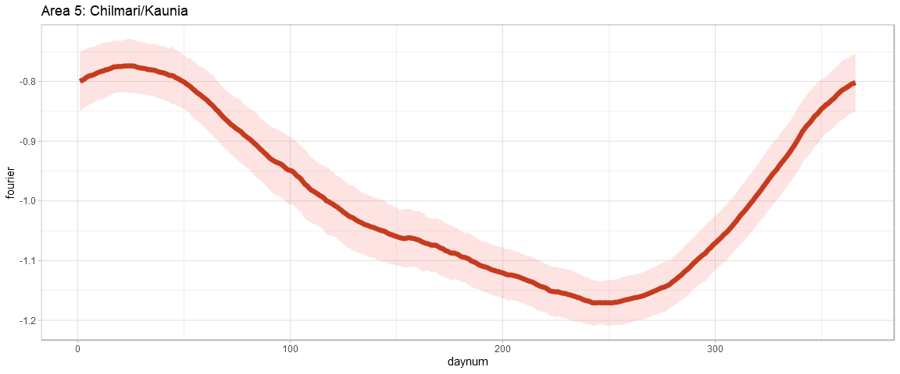

Creating Seasonal Curves in R
================
Will Simmons
9/28/2019

``` r
library(tidyverse)
```

    ## -- Attaching packages ---------------------------------------------------------------------------- tidyverse 1.2.1 --

    ## v ggplot2 3.2.1     v purrr   0.3.2
    ## v tibble  2.1.3     v dplyr   0.8.3
    ## v tidyr   1.0.0     v stringr 1.4.0
    ## v readr   1.3.1     v forcats 0.4.0

    ## -- Conflicts ------------------------------------------------------------------------------- tidyverse_conflicts() --
    ## x dplyr::filter() masks stats::filter()
    ## x dplyr::lag()    masks stats::lag()

``` r
library(readxl)
```

## Importing and viewing the data

``` r
seasonal = read_excel('./data/seasonal_data_tidy.xlsx')

seasonal
```

    ## # A tibble: 9,150 x 12
    ##    daynum fourier  lower  upper surv_area raw_mean movavg61 gaussian61
    ##     <dbl>   <dbl>  <dbl>  <dbl>     <dbl> <lgl>    <lgl>    <lgl>     
    ##  1      1  -0.701 -0.749 -0.654         1 NA       NA       NA        
    ##  2      2  -0.699 -0.748 -0.650         1 NA       NA       NA        
    ##  3      3  -0.696 -0.745 -0.647         1 NA       NA       NA        
    ##  4      4  -0.693 -0.742 -0.643         1 NA       NA       NA        
    ##  5      5  -0.689 -0.739 -0.639         1 NA       NA       NA        
    ##  6      6  -0.686 -0.734 -0.637         1 NA       NA       NA        
    ##  7      7  -0.682 -0.729 -0.635         1 NA       NA       NA        
    ##  8      8  -0.680 -0.727 -0.633         1 NA       NA       NA        
    ##  9      9  -0.678 -0.726 -0.631         1 NA       NA       NA        
    ## 10     10  -0.676 -0.723 -0.629         1 NA       NA       NA        
    ## # ... with 9,140 more rows, and 4 more variables: tmax_raw_mean <lgl>,
    ## #   tmax_movavg61 <lgl>, tmin_raw_mean <lgl>, tmin_movavg61 <lgl>

## Trying out some curves

Weʻll be drawing curves for Areas 5, 17, 11, 10, 17, 15

``` r
index_5 = seasonal$surv_area == 5

area5_plot =
seasonal[index_5,] %>% 
  ggplot(aes(x = daynum, y = fourier)) +
  geom_line(size = 1.7, color = "#BA2D0B", show.legend = FALSE) +
  geom_ribbon(aes(ymin = lower, ymax = upper, fill = "#BA2D0B"), alpha = 0.2, show.legend = FALSE) + # adding confidence limits
  ggtitle('Area 5: Chilmari/Kaunia') + 
  theme(plot.title = element_text(hjust = 0.5)) + # centering title
  theme_light()

area5_plot
```

<!-- -->
